# ai-startup-website
## Hands-On Git Project: Collaborative Website Development with Git and GitHub

In this mini project, I will crate a step by step project to simulate the workflow of Tom and Jerry using Git and GitHub. This hands-on project will include installation of Git, setting up GitHub repository, creating branches, making changes, and merging those changes back into the main branch. 

## Part 1

1. Install Git: 

   - Visit the office git website and downlaod (https://git-scm.com/downloads) the version of Git for your operating system. Folow the installtion instruction. 
2. Create a GitHub Repository:

    - Sign up or login into GitHub
    - Click the "+" icon in the top-right corner and select "New Repository".
 
       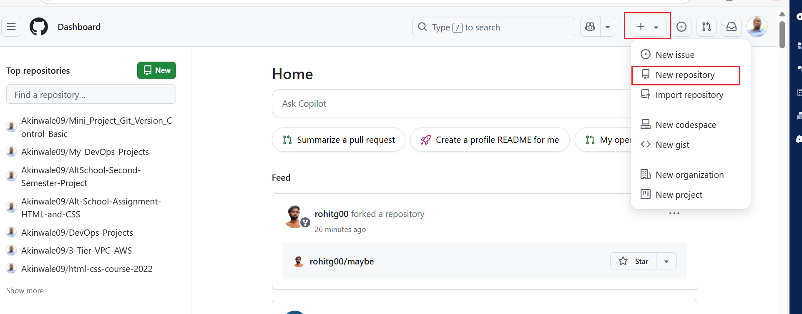
   

     - I would create my Repository and name my project ai-startup-website and initialize it with a README file

         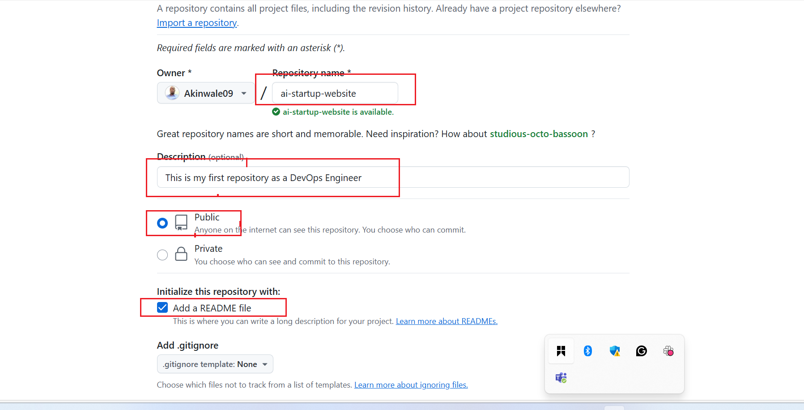
        

3. Clone the Repository
   
    - On the repository's page on GitHub, click the code button and copy the HTTPS URL

       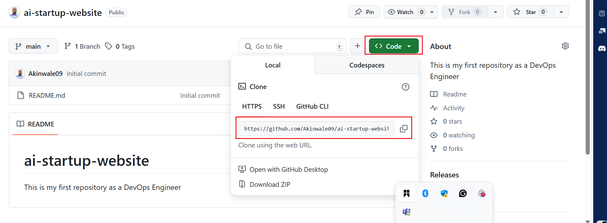
    
    - I will now open git on my pc which I already created a folder in my PC with git-project, I will do `cd` to this folder directory.

       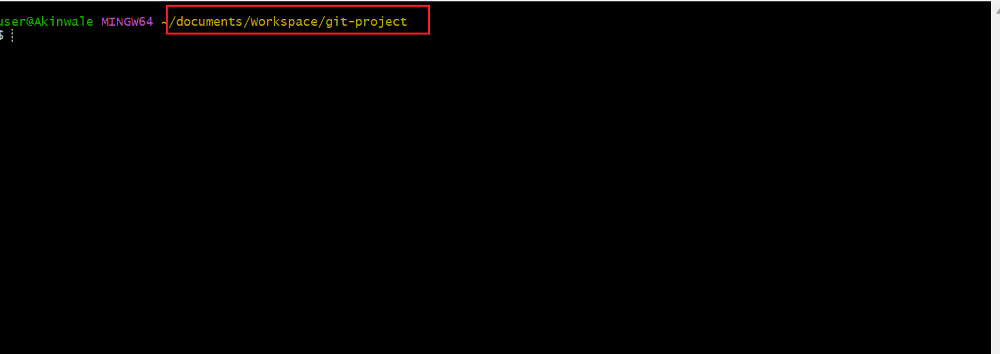
    - Clone the (Downlaod) the repository from GitHub using `git clone` 
  
       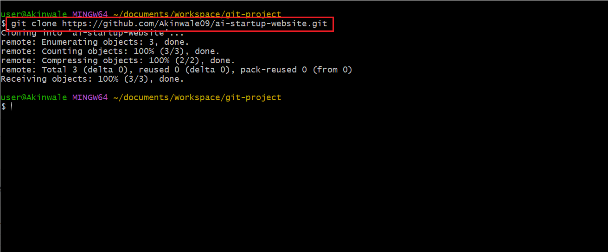

    - The project has been successfully clone to my local maching and `cd` to ai-startup-website folder

        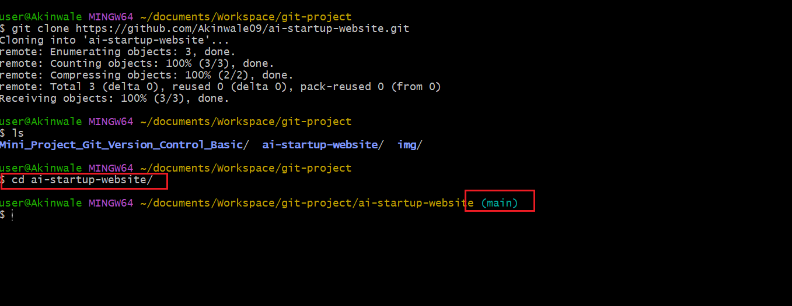

     - create a file index.html with `touch index.html`
  
         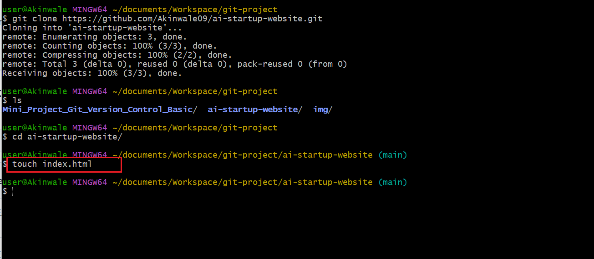

     - Add a content into the file using `vi` editor

       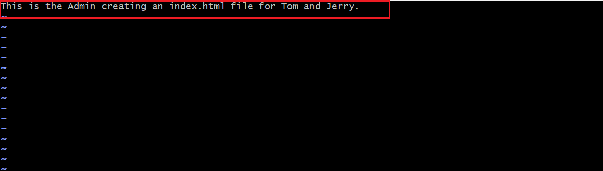

     - `cat` use cat to check the file is successfully saved

       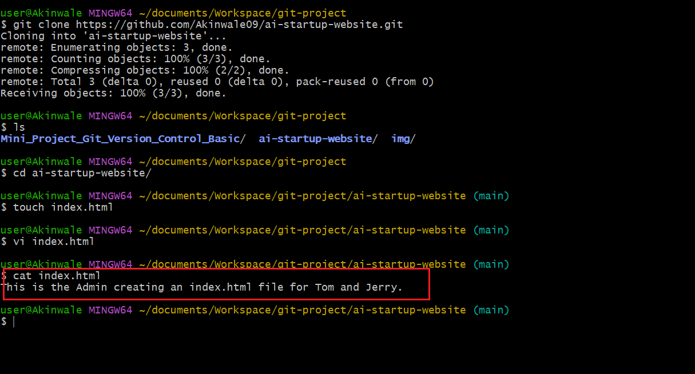

    - Check the change has not been change with 
  
      `git status`

      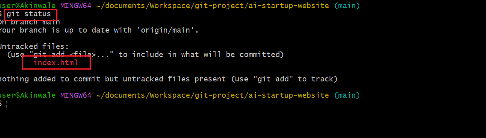

     - Stage chnages with: `git add index.html`

       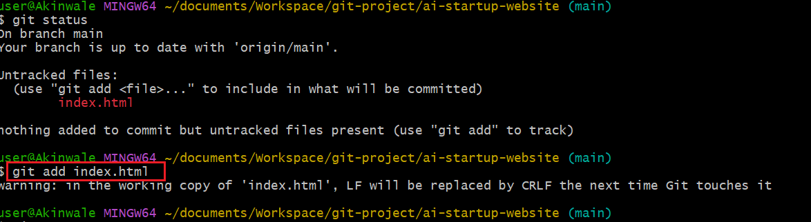

    - Confirm the changes have been staged fro commit with `git status`

        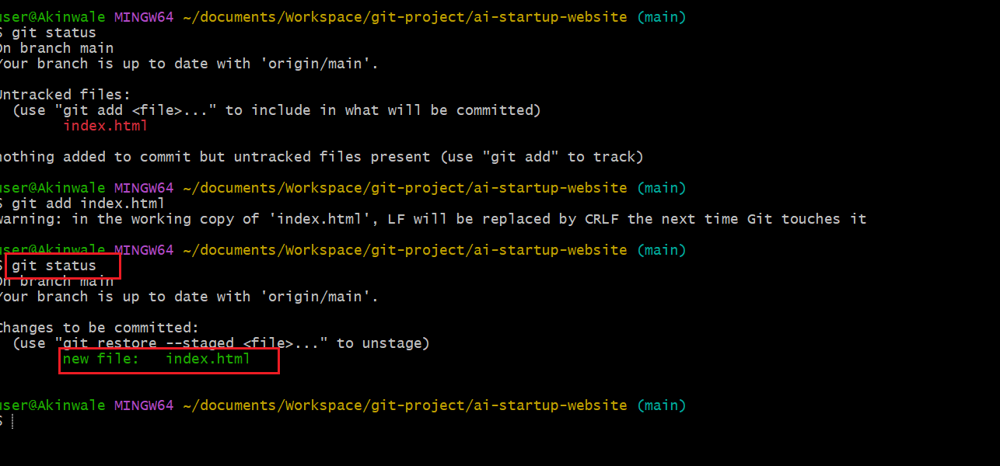

     - Now, after staging the changes, the file will appear in green in the terminal output. This color shange signifies that the file has been successfully staged, making it ready for the next step, which is commiting these changes to the project history. 

      - Commit the th change with `git commit -m "message"`
     
    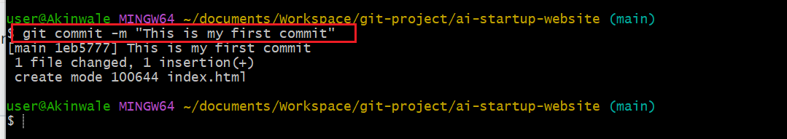

    - This takes the staged changes and records them in the repository's history with a message describing what was done. 

    - Push the main branch to GibHub: using `git push origin main`

     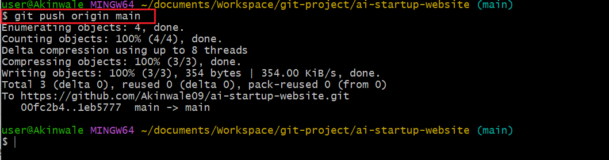

     - This sends the commits from main branch on my laptop to GitHub (Remote Repository)

## Part 2: Simulating Tom and Jerry's Work 

To simulate both Tom and Jerry working on the same Laptop, I will switch between two branches, naking chnages as each character.

1. Tom's Work:
   
    - Navigate to the project directory we clone: ai-startup-website with `cd`

     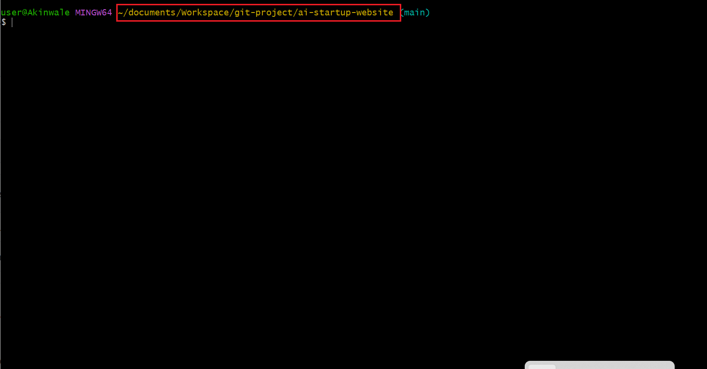

    - Check the current branch: This will show a list of all branches in local repository
  
   `git branch`

    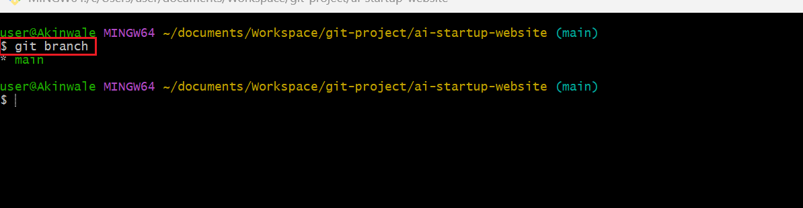

    - create a new branch for Tom's work:
  
     `git checkout -b update-navigation`

     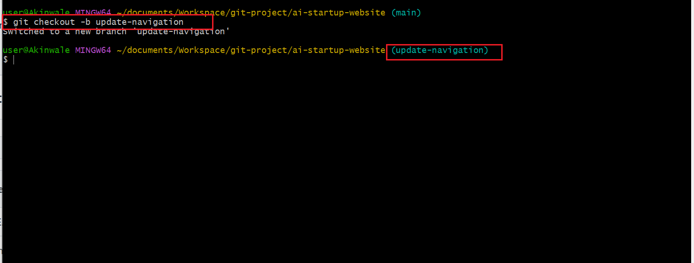

     This create a new branch name "Update-navigation". the comman also automatically switchs to the newly created branch from the "main" branch. This branch "Update-navigation" is where we will simulate Tom's updates to the website without affecting whatever is in the main branch.

     - check the branch again to see the newly created branch.

     `git branch`

     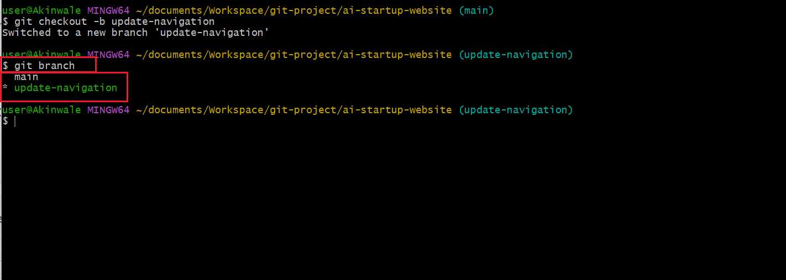

     Running `git branch` again show the newly created branch, indicating we are now working in this new workspace dedicated to Tom's navigation update. 

     - We already created an empty "index.html" in the main. Ths file will also exist in the "update-navigation-branch"

     - Lets open the "index.html" and add the content: "This is Tom adding Navigation to thr AI-Website"

       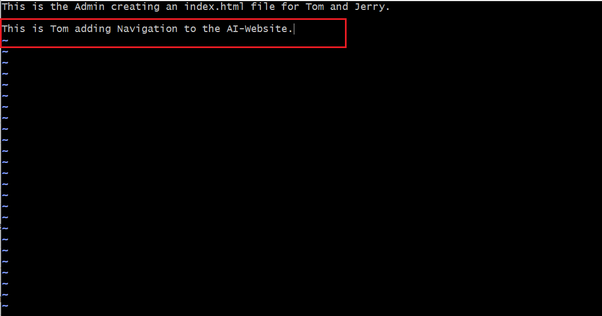

     - Check content update with `cat navigation-update`

       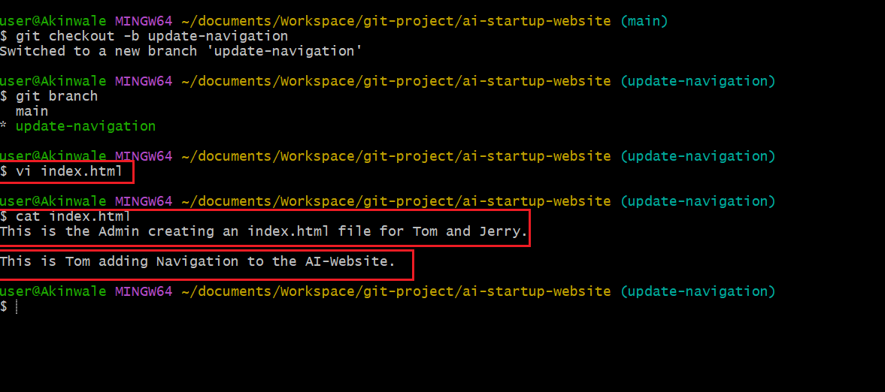

      - Check changes has not been staged

        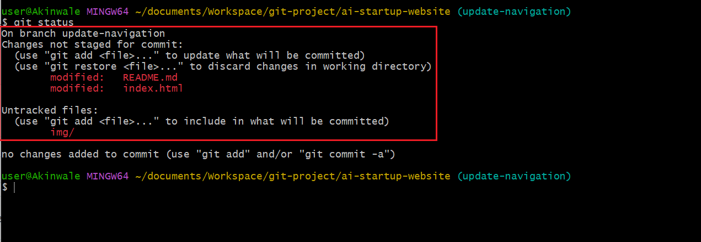

      At this stage, Tom has modified the file, but these changes haven't been prepared for a commit in Git. This indicated by the file name appaering in red in the terminal output, signaling that the changes are recognized by Git but not yet staged. 

      - Stage Tom's Changes: `git add index.html`

        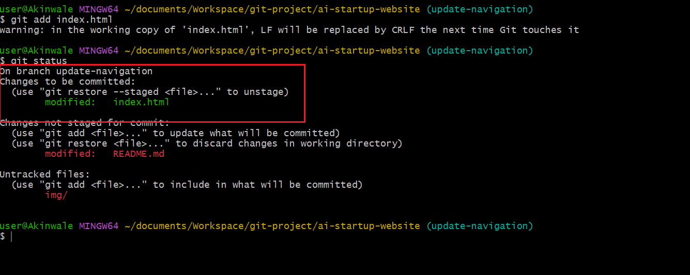

        This tells Git that you want to include the update made to "index.html" in the next commit. its's like saying, "Okay, I'm happy with these changes and ready to record them"

        - Confirm chnages have been staged for commit: `git status`

          

     Now, after stagging the changes, the file name will appear in green in the terminal output. This color changes signifies thet the filr has been successfully staged, making it ready for the next step, which is commiting these changes to the project history. 

      - Commit Tom's changess: `git commit -m "Update Navigation bar"`

        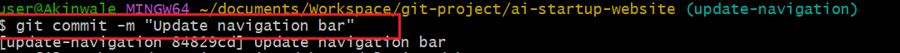

    This takes the staged changes and record them in the repository with a message describing what was done.

     - Push Toms branch to GitHub with: `git push origin update-navigation`

      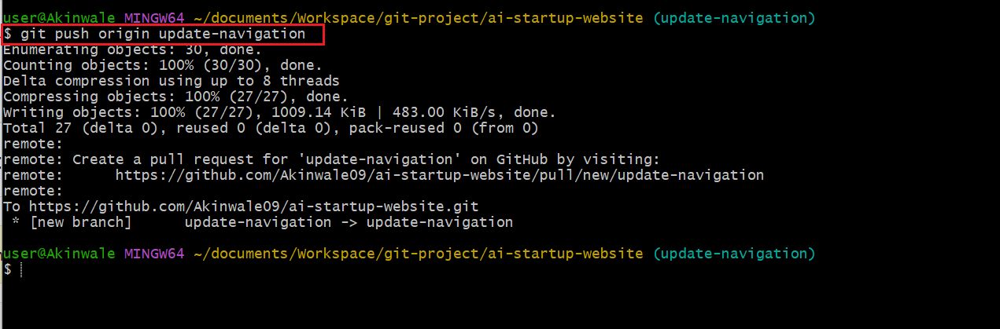

    This sends Tom's commits from local branch on the Laptop to GitHUb Repository. its like publishing our work so that other (or in this case, Jerry) can see the interact with it. This step update the remote repository with Tom's contributions. 

    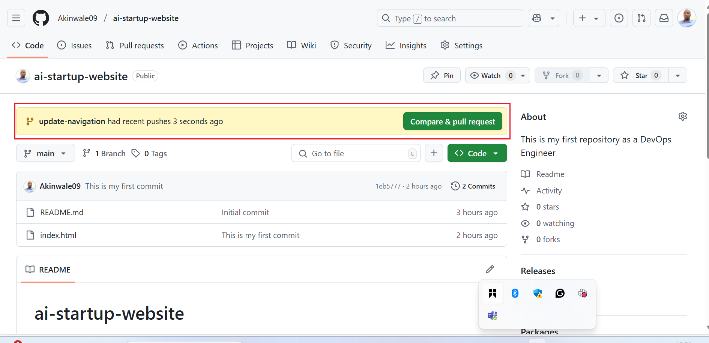 

    After completing Tom's workflow, we will now simulate Jerry's contribution to the project. To do this we will

     - Switch back to the main branch
     - Create a new branch for Jerry
     - Make changes, and then
     - Stage, commit, and push these changes to GitHub.  
    
    ## Jerry's Work:
 

    Switch back to the main branch: `git checkout main`
      
     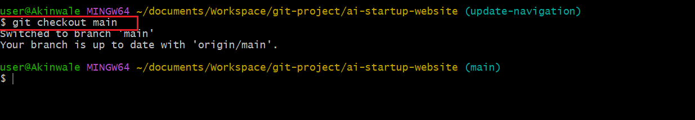

     This command switches our working directory back to the main branch, ensuring that Jerry's chnages starts from the latest version of the project. 

   Pull the latest changes fro Jerry:

   `git pull origin update-navigation`

   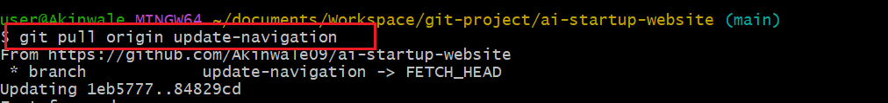

 This ensures that we have a the latest updates from the repository, including Tom's merged changes, if any.

 Create a New Branch for Jerry's Work:

 `git checkout -b add-account-info`

 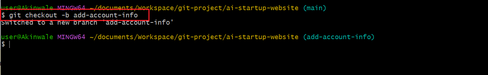

This create a new branch where Jerry will make his changes, keeping them separate from the "Main" project untill they're ready to be merged. 

I will opne the "index.html" and add Contact Information: I will make the changes in index.html file by addding contact information. This simulate Jerry's task

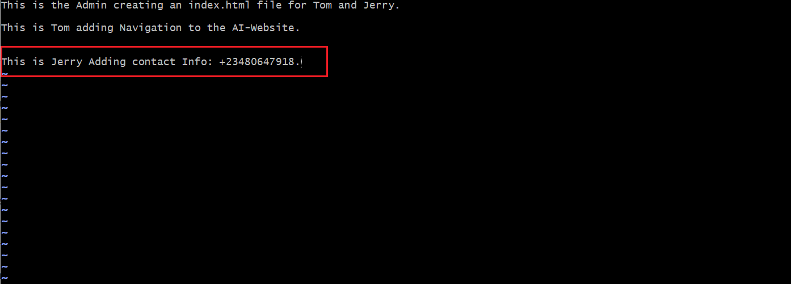

Confirm Jerry changes using `cat index.html`

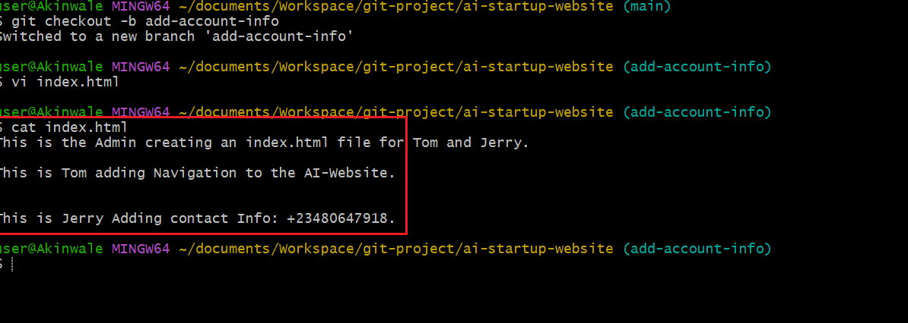

I will also stage Jerry's Changes.

`git add index.html`

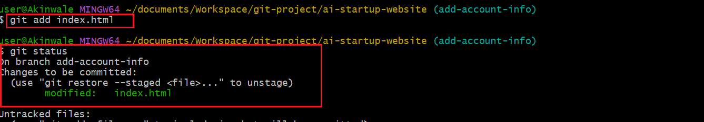

This command stages the changes Jerry made to the index.html file, preparing them for commit.

Commit Jerry's Changes:

`git commit -m "Add contact information"`

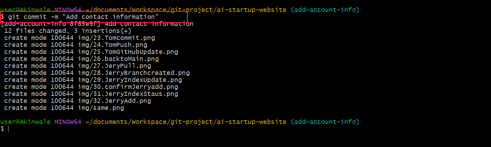

This saves Jerry's changes in the branch's history, with a message describing what was done. 

Push Jerry's Branch to GitHub:

`git push origin add-account-info`

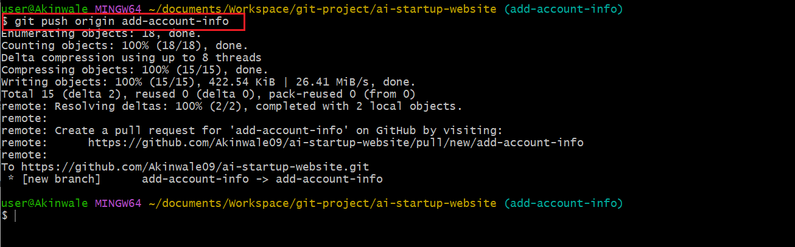

This command upload Jerry's branch to the GitHub repository, making it available for review and merging into the main project. 

Jerry Push to GitHub:

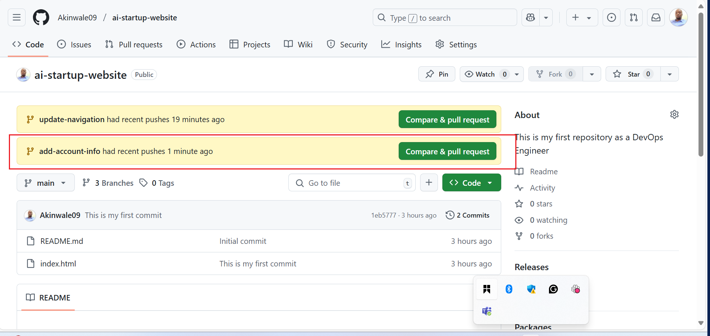

Now, someone now need to review both Tom and Jerry work, merge the changes to the mainproject, and resolve conflict if any.  