# ai-startup-website
## Hands-On Git Project: Collaborative Website Development with Git and GitHub

In this mini project, I will crate a step by step project to simulate the workflow of Tom and Jerry using Git and GitHub. This hands-on project will include installation of Git, setting up GitHub repository, creating branches, making changes, and merging those changes back into the main branch. 

## Part 1

1. Install Git: 

   - Visit the office git website and downlaod (https://git-scm.com/downloads) the version of Git for your operating system. Folow the installtion instruction. 
2. Create a GitHub Repository:

    - Sign up or login into GitHub
    - Click the "+" icon in the top-right corner and select "New Repository".
 
       
   

     - I would create my Repository and name my project ai-startup-website and initialize it with a README file

         
        

3. Clone the Repository
   
    - On the repository's page on GitHub, click the code button and copy the HTTPS URL

       
    
    - I will now open git on my pc which I already created a folder in my PC with git-project, I will do `cd` to this folder directory.

       
    - Clone the (Downlaod) the repository from GitHub using `git clone` 
  
       

    - The project has been successfully clone to my local maching and `cd` to ai-startup-website folder

        

     - create a file index.html with `touch index.html`
  
         

     - Add a content into the file using `vi` editor

       

     - `cat` use cat to check the file is successfully saved

       

    - Check the change has not been change with 
  
      `git status`

      

     - Stage chnages with: `git add index.html`

       

    - Confirm the changes have been staged fro commit with `git status`

        

     - Now, after staging the changes, the file will appear in green in the terminal output. This color shange signifies that the file has been successfully staged, making it ready for the next step, which is commiting these changes to the project history. 

      - Commit the th change with `git commit -m "message"`
     
    

    - This takes the staged changes and records them in the repository's history with a message describing what was done. 

    - Push the main branch to GibHub: using `git push origin main`

     

     - This sends the commits from main branch on my laptop to GitHub (Remote Repository)

## Part 2: Simulating Tom and Jerry's Work 

To simulate both Tom and Jerry working on the same Laptop, I will switch between two branches, naking chnages as each character.

1. Tom's Work:
   
    - Navigate to the project directory we clone: ai-startup-website with `cd`

     

    - Check the current branch: This will show a list of all branches in local repository
  
   `git branch`

    

    - create a new branch for Tom's work:
  
     `git checkout -b update-navigation`

     

     This create a new branch name "Update-navigation". the comman also automatically switchs to the newly created branch from the "main" branch. This branch "Update-navigation" is where we will simulate Tom's updates to the website without affecting whatever is in the main branch.

     - check the branch again to see the newly created branch.

     `git branch`

     

     Running `git branch` again show the newly created branch, indicating we are now working in this new workspace dedicated to Tom's navigation update. 

     - We already created an empty "index.html" in the main. Ths file will also exist in the "update-navigation-branch"

     - Lets open the "index.html" and add the content: "This is Tom adding Navigation to thr AI-Website"

       

     - Check content update with `cat navigation-update`

       

      - Check changes has not been staged

        

      At this stage, Tom has modified the file, but these changes haven't been prepared for a commit in Git. This indicated by the file name appaering in red in the terminal output, signaling that the changes are recognized by Git but not yet staged. 

      - Stage Tom's Changes: `git add index.html`

        

        This tells Git that you want to include the update made to "index.html" in the next commit. its's like saying, "Okay, I'm happy with these changes and ready to record them"

        - Confirm chnages have been staged for commit: `git status`

          

     Now, after stagging the changes, the file name will appear in green in the terminal output. This color changes signifies thet the filr has been successfully staged, making it ready for the next step, which is commiting these changes to the project history. 

      - Commit Tom's changess: `git commit -m "Update Navigation bar"`

        

    This takes the staged changes and record them in the repository with a message describing what was done.

     - Push Toms branch to GitHub with: `git push origin update-navigation`

      

    This sends Tom's commits from local branch on the Laptop to GitHUb Repository. its like publishing our work so that other (or in this case, Jerry) can see the interact with it. This step update the remote repository with Tom's contributions. 

     

    After completing Tom's workflow, we will now simulate Jerry's contribution to the project. To do this we will

     - Switch back to the main branch
     - Create a new branch for Jerry
     - Make changes, and then
     - Stage, commit, and push these changes to GitHub.  
    
    ## Jerry's Work:
 

    Switch back to the main branch: `git checkout main`
      
     

     This command switches our working directory back to the main branch, ensuring that Jerry's chnages starts from the latest version of the project. 

   Pull the latest changes fro Jerry:

   `git pull origin update-navigation`

   

 This ensures that we have a the latest updates from the repository, including Tom's merged changes, if any.

 Create a New Branch for Jerry's Work:

 `git checkout -b add-account-info`

 

This create a new branch where Jerry will make his changes, keeping them separate from the "Main" project untill they're ready to be merged. 

I will opne the "index.html" and add Contact Information: I will make the changes in index.html file by addding contact information. This simulate Jerry's task

Confirm Jerry changes using `cat index.html`

I will also stage Jerry's Changes.

`git add index.html`

This command stages the changes Jerry made to the index.html file, preparing them for commit.

Commit Jerry's Changes:

`git commit -m "Add contact information"`

This saves Jerry's changes in the branch's history, with a message describing what was done. 

Push Jerry's Branch to GitHub:

`git push origin add-account-info`

This command upload Jerry's branch to the GitHub repository, making it available for review and merging into the main project. 

Jerry Push to GitHub:

Now, someone now need to review both Tom and Jerry work, merge the changes to the mainproject, and resolve conflict if any.  

# Git Branching and Merging 
## Part 3: Merging Changes

After both Tom and Jerry have pushed thier changes, you (or another team member) can review and merge these changes into the main project. The process invloves. 

1. Creating pull request
2. Merging the Pull Request into main branch.

A Pull Request (PR) is a feature used in GitHub (and other Git -based version controls) that allows you to notify team members about the changes you've pusshed to a branch in a repository. Essentially, it's a request to review and pull in your contribution to the main project. Pull request are central to the collaborative development process, enabling team member to discuss, review and make further changes before chnages are merged.

### Creating a Pull Request on GitHub

After both Tom and Jerry have pushed thier work to thier respective branches, the next step is to create a pull request for each of them. Here's how Tom would create a pull request for his changes:

1. Navigate to the GitHub Repository: from web browser, we go to the GibHub page.
2. Switch to the Branch: We click on the branch dropdown menu near the top left corner of the file list and select the branch Tom been working on, in this case, "Update-Navigation" branch.

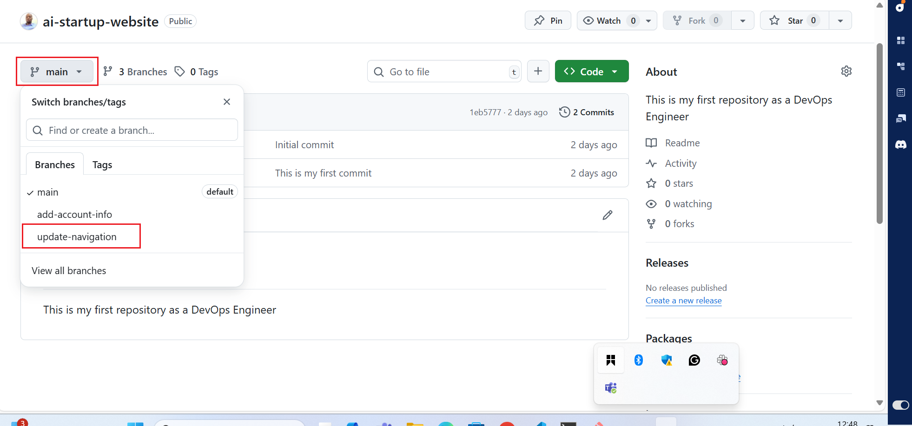

3. Create New Pull Request: Click on New Pull Request button next to branch drop down

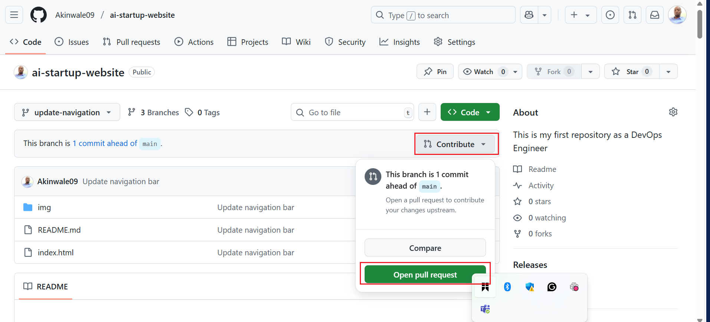

Git up will take you to a new page to initiate a pull request. It automatically selects the main project's branches as the base and your recently pushed branches as the compare branch. 

4. Review Tom's Changes:
   
   Before creating the pull request, Tom would reveiw his chnages to ensure everything is correct. GitHub shows the differences between the base branch and Tom's branch. It's a good opportunity for Tom to double-check his work. 

5. Create the pull request:

   - If everything looks good, click the create pull request button.
   - Probvide a title and dexcription for the pull request. The title should be concise and descriptive, and the description should explain the chnages that the pull request is about, why its needed and any other relevant deytails. 
   - After filling in the information, click create pull request again to officially open the pull request. 

     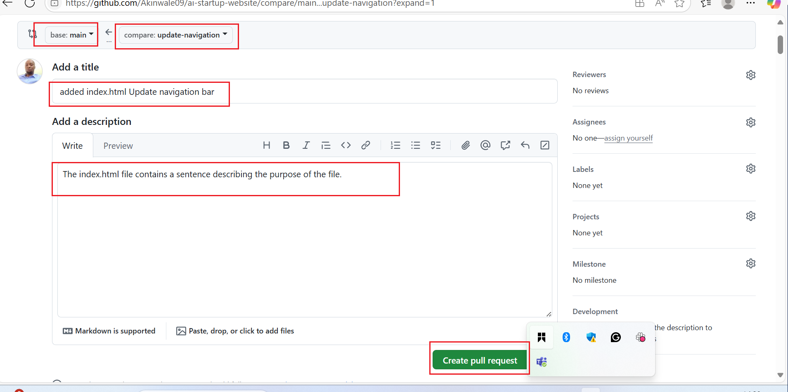

### Review and Merging Tom's Pull Request

Once the pull request is created, it becomes visible to other team memeber who can review the chnages, leave comment and request additional modifications if necessary. When the team agrees that the chnages are ready and good to go, someone with merge permission can merge the pull request, incorporating the changes from Tom's update-navigation branch ionto the main branch. 

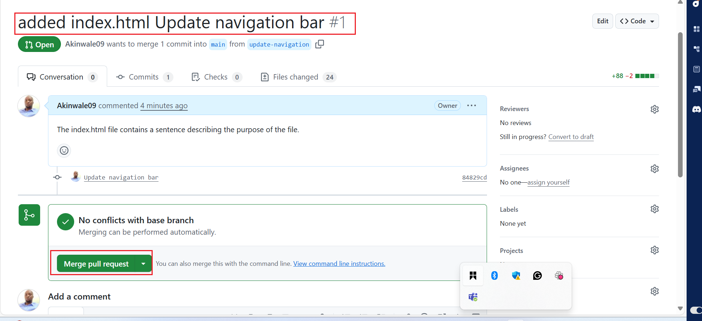
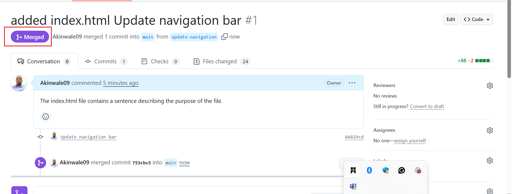

### Updating Jerry's Branch with Latest Changes

Before Jerry merges his changes into the main branch, it's is essential to ensure his branch is up to dat with the main branch. This is because other changes (like Tom's update) might have been merged into the main branch after Jerry started working on his features. Updating ensure compatibility and reduces the chances of conflicts. 

### Steps to Update Jerry's Branch:

  - On the terminal, switch to Jerry's Branch:

    `git checkout add-account-into`

    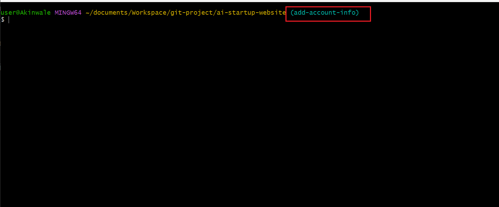

   - Pull the Latest changes from the main Branch:

     `git pull origin main`

     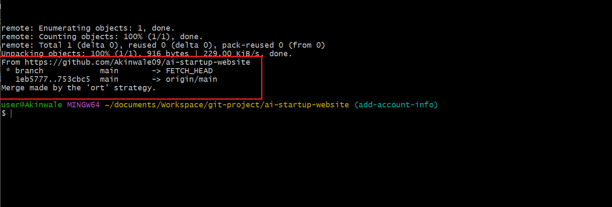

Purpose: This command fetches the chnages from the main branch (Remember, main branch now has Tom's chnages) and merges them into Jerry's add-account-info branch. It ensures that any updates made to the main branch, like Tom's merged changes, are now included in jerry branch. This step is crucial for avoiding conflicts and ensuring that jerry's work can smoothly integrate with the main project.

Merge the pull request to the main branch: Click the merge pull request button to merge Tom's changes into the main branch. This action combines Tom's contibution with the rest of the project, completing the collaborative workflow. 

### Finalizing Jerry's Contribution

Assuming there are no conflicts, Jerry's branch is now ready to be merged back into the main project. 

  - Push the updated Branch to GitHub:

     `git push origin add-account-info`

     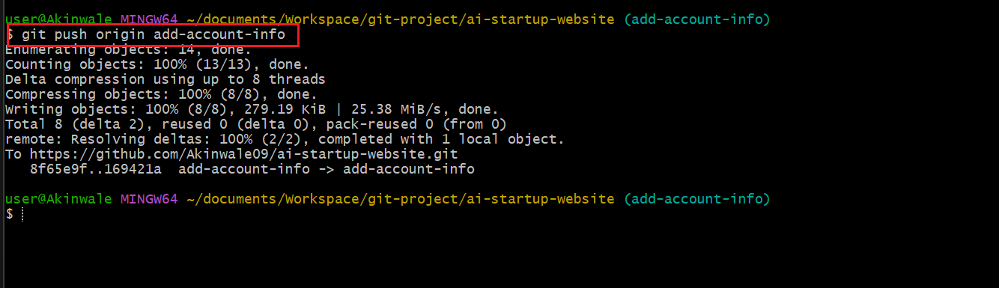

Jerry Push Pull Request on the GitHub Remote Repository

   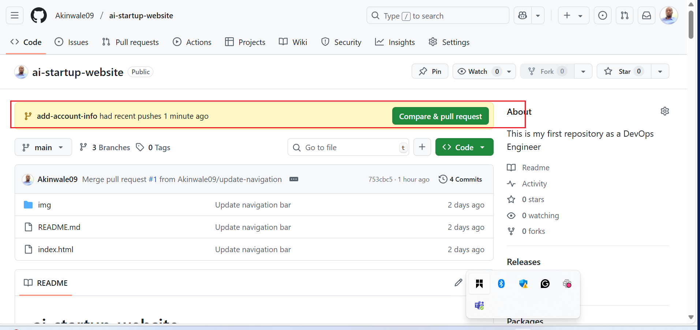 

This command upload Jerry's changes to the GitHub. Now, his branch reflects both his work and lates updates from the main branch. 

The origin keyword in the command refers to the default name Git gives to the remote repository from which we clone the project. Its like a shortcut or an alias for the full URL of the repository in GitHub. 

Now lets create the pull request (PR) for jerry's changes, similar to how we did for Tom.

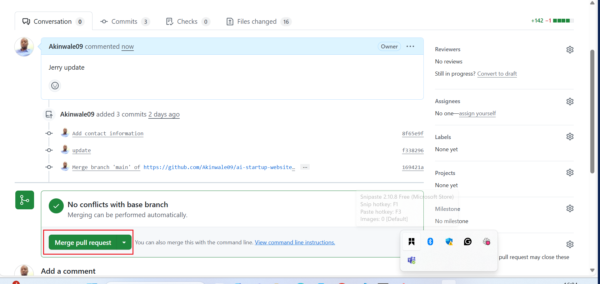

Merged Jerry's pull request. complete the process by merging the PR into the main branch. 

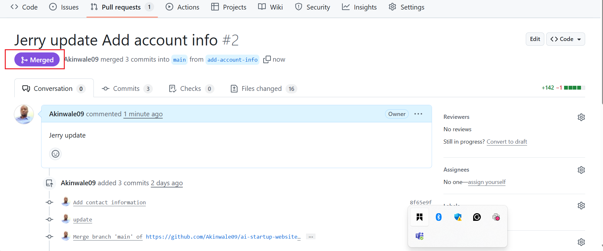

This simulated workflow illustrate how Git facilitate collaboartive development, allowing multiple work simulataneously on different aspect of a project and merge thier contribution seamlessly, even while working on thesame files.

End.